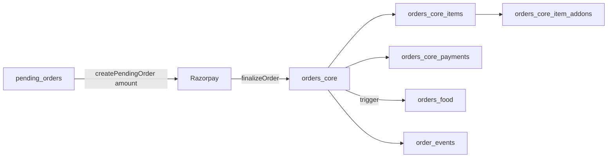

# Order domain: tables, roles, and consolidation guidance

This document matches the **GatiMitra backend** Drizzle schema ([`src/db/schema.ts`](../src/db/schema.ts)) and SQL migrations under [`drizzle/`](../drizzle/). Your Supabase UI may also show **older or parallel** tables (e.g. a very wide `public.orders` “god table”) that are **not** the primary write path for the customer checkout implemented in this repo.

## How to audit “order*” tables in the database

1. **SQL file (full detail):** run [`scripts/audit-order-tables.sql`](../scripts/audit-order-tables.sql) with `psql` or the Supabase SQL editor.
2. **Node (summary):** `cd backend && npx tsx scripts/audit-order-tables.ts` (requires `DATABASE_URL`).

## Canonical lifecycle (customer app — food)

| Phase | Table | Role |
|--------|--------|------|
| Quote / preview | *(none)* | Billing engine only; `POST /v1/billing/calculate` |
| Checkout lock | `pending_orders` | Cart JSON, `billing_snapshot`, `grand_total`, TTL, `finalized_order_id` |
| Paid order | `orders_core` | **Canonical** `order_id` (text, `GM…`), money, addresses, `billing_snapshot`, status |
| Line items | `orders_core_items` | Menu lines; FK `order_id` → `orders_core.order_id` |
| Add-ons | `orders_core_item_addons` | Per line |
| Payment proof | `orders_core_payments` | Razorpay ids, amount, status |
| Food vertical | `orders_food` | Kitchen/OTP/UI fields; synced by DB triggers from `orders_core` (`core_order_id` = `orders_core.order_id`) |
| Timeline | `order_events` | Append-only events (`order_id` text) |
| Dispatch | `delivery_assignments`, `order_rider_tracking`, … | Rider ops |

## OMS / ledger (additive — migration `0182`)

These extend the same **`orders_core.order_id`** (text) for audit and refunds:

- `order_version_snapshots`, `order_charge_lines`, `order_tax_lines`, `order_discount_lines`, `order_bill_summary_versions`
- `payment_intents`, `payment_transactions`, `refund_intents`, `refund_transactions`, …
- `ledger_*` (double-entry shadow)

Apply migration [`0182_oms_billing_ledger_foundation.sql`](../drizzle/0182_oms_billing_ledger_foundation.sql) if not already on the database.

## Legacy / parallel tables (common confusion)

| Object | Typical role | Recommendation |
|--------|----------------|----------------|
| `orders` (slim, in Drizzle) | Early multi-type rider/dispatch model | If unused by app code, **stop writing**; archive or drop after traffic audit |
| `orders` (very wide Supabase DDL you pasted) | Historical “everything in one row” + aggregators | **Do not** extend; migrate reads to `orders_core` + vertical tables; plan **read-only** period then deprecate |
| `orders_core_backup` | Backup | Keep until retention policy says drop |
| `orders_food` | Food extension | **Keep**; join to `orders_core` via `core_order_id` / `order_id` |
| `provider_order_*` | External marketplace IDs | **Keep** for integration; map `provider_order_id` ↔ `orders_core.order_id` in app layer |
| `pending_orders` | Pre-auth basket | **Keep** |

## Reporting views (migration `0189`)

- `v_order_domain_food` — `orders_core` + `orders_food` for analytics.
- `v_order_core_payments_latest` — latest payment row per order.

## Consolidation strategy (safe order of operations)

1. **Inventory:** run the audit scripts; export FK graph.
2. **Single write path:** ensure all new food orders go to `pending_orders` → `orders_core` only (this repo already does).
3. **Read cutover:** point dashboards to `v_order_domain_food` / `orders_core`.
4. **Legacy `orders` (wide):** freeze writes; backfill missing rows from `orders_core` if needed; then drop or rename to `orders_legacy_archive`.
5. **RLS:** tighten Supabase policies on `pending_orders` / `orders_core` (your screenshot showed many tables as UNRESTRICTED).

## Refund / cancel scenarios

- **Cancel before pay:** delete or expire `pending_orders` (app logic).
- **Cancel after pay:** update `orders_core.status` / `cancelled_at`, append `order_events`, trigger refund via Razorpay → store in `refund_*` tables when OMS migration is applied.
- **Payment mismatch:** `finalizeOrder` verifies Razorpay amount vs `pending_orders.grand_total`; ledger rows optional via `OMS_LEDGER_SHADOW_WRITE`.

This file is **documentation only**; migrations live under `backend/drizzle/`.
