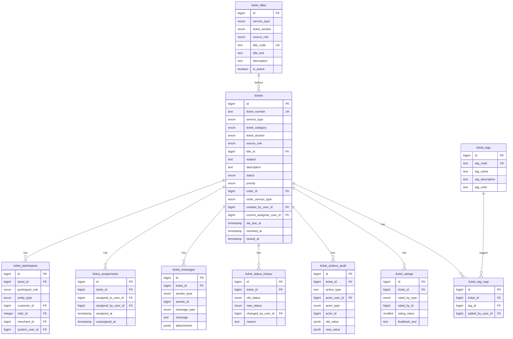
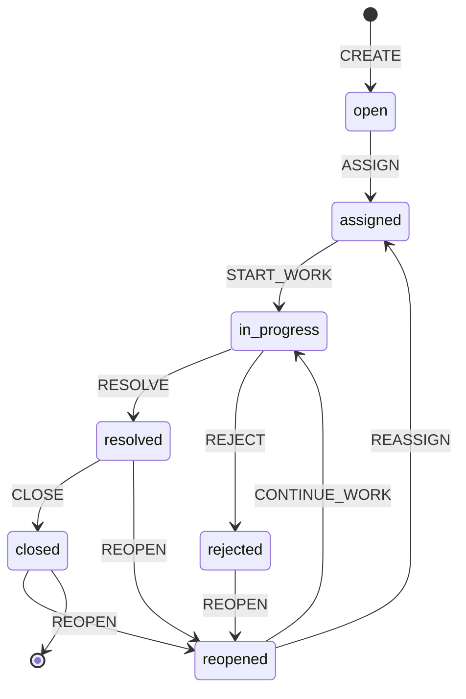

# Enterprise-Grade Multi-Service Ticket System

## Overview

This document describes the enterprise-grade ticket management system designed for high-scale operations (10M+ tickets) with full auditability, service-wise RBAC, and long-term scalability.

**Key Features:**
- Unified ticket system for all services (food, parcel, person_ride, other)
- Dynamic title catalog (replaces enum-based titles)
- Polymorphic participant tracking
- Complete assignment history
- Immutable audit logs
- Post-resolution ratings
- Many-to-many tag system
- Service-wise permission model

---

## Architecture

### Core Design Principles

1. **ONE unified `tickets` table** - Single source of truth
2. **Dynamic title catalog** - Configurable per service/section/source
3. **Polymorphic participants** - Track all parties involved
4. **Full assignment history** - Never overwrite assignments
5. **Immutable audit logs** - Append-only action tracking
6. **Post-resolution ratings** - Feedback after ticket closure
7. **Many-to-many tags** - Flexible categorization

### Entity Relationship Diagram



---

## Ticket Lifecycle

### State Machine



### Lifecycle Flow

1. **CREATE** → `status: open`
   - Insert into `tickets` table
   - Create participants in `ticket_participants`
   - Log action in `ticket_actions_audit`

2. **ASSIGN** → `status: assigned`
   - Insert into `ticket_assignments`
   - Update `current_assignee_user_id` in `tickets`
   - Log status change in `ticket_status_history`
   - Log action in `ticket_actions_audit`

3. **START WORK** → `status: in_progress`
   - Update status in `tickets`
   - Log status change in `ticket_status_history`
   - Log action in `ticket_actions_audit`

4. **RESOLVE** → `status: resolved`
   - Update `resolved_at` in `tickets`
   - Log status change in `ticket_status_history`
   - Log action in `ticket_actions_audit`
   - **Rating window opens**

5. **RATING** → Submit rating
   - Insert into `ticket_ratings`
   - One rating per ticket per actor
   - Only allowed when status is `resolved` or `closed`

6. **CLOSE** → `status: closed`
   - Update `closed_at` in `tickets`
   - Log status change in `ticket_status_history` (reason required)
   - Log action in `ticket_actions_audit`

7. **REOPEN** → `status: reopened`
   - Insert into `ticket_status_history` (reason required)
   - Reset SLA if configured
   - Reassign or notify agent
   - Log action in `ticket_actions_audit`
   - Transition back to `assigned` or `in_progress`

---

## Database Schema

### Tables

#### 1. `tickets` - Main Entity

**Purpose:** Single source of truth for all tickets

**Key Fields:**
- `ticket_number` - Globally unique identifier (TKT-YYYY-NNNNNN)
- `service_type` - food, parcel, person_ride, other
- `ticket_category` - order_related, non_order, other
- `ticket_section` - customer, rider, merchant, system, other
- `source_role` - customer, customer_pickup, customer_drop, rider, merchant, system
- `title_id` - FK to `ticket_titles`
- `subject` - Snapshot of title text at creation
- `status` - open, assigned, in_progress, resolved, closed, rejected, reopened
- `priority` - low, medium, high, urgent, critical
- `sla_due_at` - SLA due date/time

**Constraints:**
- `ticket_number` must match pattern: `^TKT-\d{4}-\d{6}$`
- For `order_related` tickets, `order_id` must be NOT NULL
- Tickets are never deleted (soft delete via status)

#### 2. `ticket_titles` - Dynamic Title Catalog

**Purpose:** Configurable titles per service/section/source

**Key Fields:**
- `service_type` - Which service this title applies to
- `ticket_section` - Which section (customer, rider, merchant, system)
- `source_role` - Which source role
- `title_code` - Stable identifier (e.g., "ORDER_DELAYED")
- `title_text` - Display text
- `is_active` - Whether title is available for selection

**Usage:**
- Titles can be enabled/disabled without affecting existing tickets
- Subject field in tickets stores snapshot at creation time
- Allows analytics on title usage

#### 3. `ticket_participants` - Polymorphic Actors

**Purpose:** Track all parties involved in ticket

**Key Fields:**
- `participant_role` - creator, affected_party, pickup, drop
- `entity_type` - customer, rider, merchant, system
- Exactly one of: `customer_id`, `rider_id`, `merchant_id`, `system_user_id`

**Use Cases:**
- Parcel tickets with two customers (pickup and drop)
- Order-related tickets with customer, rider, and merchant
- System-generated tickets with system user

#### 4. `ticket_assignments` - Assignment History

**Purpose:** Complete history of all assignments

**Key Fields:**
- `assigned_to_user_id` - Who was assigned
- `assigned_by_user_id` - Who made the assignment
- `assigned_at` - When assigned
- `unassigned_at` - When unassigned (NULL = currently assigned)

**Features:**
- Never overwritten
- Tracks reassignments
- Supports workload queries

#### 5. `ticket_messages` - Conversation Thread

**Purpose:** All messages, replies, internal notes, system messages

**Key Fields:**
- `sender_type` - customer, rider, merchant, agent, system
- `sender_id` - Polymorphic sender ID
- `message_type` - reply, internal_note, system
- `attachments` - JSONB array of attachment objects
- `edited_at` - When message was edited

#### 6. `ticket_status_history` - Status Transitions

**Purpose:** Complete history of status changes

**Key Fields:**
- `old_status` - Previous status
- `new_status` - New status
- `changed_by_user_id` - Who made the change
- `reason` - Mandatory for close/reject/reopen

**Features:**
- Every status change is logged
- Reason required for critical transitions
- Supports audit and analytics

#### 7. `ticket_actions_audit` - Immutable Audit Log

**Purpose:** Append-only log of all actions

**Key Fields:**
- `action_type` - create, assign, reply, resolve, close, reject, reopen, priority_change, title_change, sla_override, tag_change
- `actor_user_id` - System user who performed action
- `actor_type` - customer, rider, merchant, system
- `actor_id` - Polymorphic actor ID
- `old_value` - JSONB of old state
- `new_value` - JSONB of new state

**Features:**
- Append-only (never updated or deleted)
- Complete audit trail
- Supports compliance and forensics

#### 8. `ticket_ratings` - Post-Resolution Feedback

**Purpose:** Ratings submitted after resolution/closure

**Key Fields:**
- `rated_by_type` - customer, rider, merchant
- `rated_by_id` - ID of rater
- `rating_value` - 1-5 scale
- `feedback_text` - Optional feedback

**Constraints:**
- One rating per ticket per actor (unique constraint)
- Only allowed when ticket is `resolved` or `closed`

#### 9. `ticket_tags` & `ticket_tag_map` - Tag System

**Purpose:** Many-to-many tag mapping for categorization

**Default Tags:**
- `fraud` - Fraud-related tickets
- `abuse` - Abuse-related tickets
- `escalation` - Escalated tickets
- `refund` - Refund requests
- `technical` - Technical issues
- `sla_breach` - SLA breaches

**Features:**
- Many-to-many relationship
- Tracks who added tag and when
- Supports filtering and analytics

---

## Permission Model (Service-Wise RBAC)

### Permission Format

```
ticket.{action}.{service}
```

### Actions

- `view` - View tickets
- `action.assign` - Assign tickets
- `action.reply` - Reply to tickets
- `action.resolve` - Resolve tickets
- `action.close` - Close tickets
- `action.reopen` - Reopen tickets

### Services

- `food` - Food service tickets
- `parcel` - Parcel service tickets
- `person_ride` - Person ride service tickets
- `other` - Other/System tickets

### Examples

- `ticket.view.food` - View food tickets
- `ticket.action.assign.parcel` - Assign parcel tickets
- `ticket.action.reply.person_ride` - Reply to person ride tickets
- `ticket.action.resolve.food` - Resolve food tickets

### Enforcement

1. **API Level:** Check permissions before any action
2. **UI Level:** Render buttons based on permissions
3. **Query Level:** Filter tickets based on service permissions

---

## Sample Queries

### 1. List Tickets with Pagination

```sql
-- Get tickets for a specific service with pagination
SELECT 
  t.id,
  t.ticket_number,
  t.service_type,
  t.status,
  t.priority,
  t.subject,
  t.created_at,
  tt.title_text,
  u.full_name as assignee_name
FROM tickets t
LEFT JOIN ticket_titles tt ON t.title_id = tt.id
LEFT JOIN system_users u ON t.current_assignee_user_id = u.id
WHERE t.service_type = 'food'
  AND t.status IN ('open', 'assigned', 'in_progress')
ORDER BY t.created_at DESC
LIMIT 50 OFFSET 0;
```

### 2. Get Ticket with Full Details

```sql
-- Get ticket with all related data
SELECT 
  t.*,
  tt.title_text,
  tt.description as title_description,
  creator.full_name as created_by_name,
  assignee.full_name as assignee_name
FROM tickets t
LEFT JOIN ticket_titles tt ON t.title_id = tt.id
LEFT JOIN system_users creator ON t.created_by_user_id = creator.id
LEFT JOIN system_users assignee ON t.current_assignee_user_id = assignee.id
WHERE t.ticket_number = 'TKT-2026-000001';
```

### 3. Get Ticket Participants

```sql
-- Get all participants for a ticket
SELECT 
  tp.participant_role,
  tp.entity_type,
  CASE 
    WHEN tp.entity_type = 'customer' THEN c.name
    WHEN tp.entity_type = 'rider' THEN r.name
    WHEN tp.entity_type = 'merchant' THEN ms.store_name
    WHEN tp.entity_type = 'system' THEN su.full_name
  END as participant_name
FROM ticket_participants tp
LEFT JOIN customers c ON tp.customer_id = c.id
LEFT JOIN riders r ON tp.rider_id = r.id
LEFT JOIN merchant_stores ms ON tp.merchant_id = ms.id
LEFT JOIN system_users su ON tp.system_user_id = su.id
WHERE tp.ticket_id = 123;
```

### 4. Get Assignment History

```sql
-- Get complete assignment history for a ticket
SELECT 
  ta.assigned_at,
  ta.unassigned_at,
  assigned_to.full_name as assigned_to_name,
  assigned_by.full_name as assigned_by_name,
  ta.reason
FROM ticket_assignments ta
LEFT JOIN system_users assigned_to ON ta.assigned_to_user_id = assigned_to.id
LEFT JOIN system_users assigned_by ON ta.assigned_by_user_id = assigned_by.id
WHERE ta.ticket_id = 123
ORDER BY ta.assigned_at DESC;
```

### 5. Get Status History

```sql
-- Get status change history
SELECT 
  tsh.old_status,
  tsh.new_status,
  tsh.reason,
  tsh.created_at,
  u.full_name as changed_by_name
FROM ticket_status_history tsh
LEFT JOIN system_users u ON tsh.changed_by_user_id = u.id
WHERE tsh.ticket_id = 123
ORDER BY tsh.created_at DESC;
```

### 6. Get Agent Workload

```sql
-- Get current workload for an agent
SELECT 
  COUNT(*) as open_tickets,
  COUNT(*) FILTER (WHERE t.status = 'assigned') as assigned_count,
  COUNT(*) FILTER (WHERE t.status = 'in_progress') as in_progress_count,
  COUNT(*) FILTER (WHERE t.sla_due_at < NOW() AND t.status NOT IN ('closed', 'resolved')) as sla_breach_count
FROM tickets t
WHERE t.current_assignee_user_id = 456
  AND t.status NOT IN ('closed', 'resolved');
```

### 7. Get SLA Breach Tickets

```sql
-- Get tickets with breached SLA
SELECT 
  t.ticket_number,
  t.service_type,
  t.status,
  t.priority,
  t.sla_due_at,
  NOW() - t.sla_due_at as breach_duration,
  u.full_name as assignee_name
FROM tickets t
LEFT JOIN system_users u ON t.current_assignee_user_id = u.id
WHERE t.sla_due_at < NOW()
  AND t.status NOT IN ('closed', 'resolved')
ORDER BY t.sla_due_at ASC;
```

### 8. Get Ticket Ratings

```sql
-- Get all ratings for a ticket
SELECT 
  tr.rated_by_type,
  tr.rated_by_id,
  tr.rating_value,
  tr.feedback_text,
  tr.created_at
FROM ticket_ratings tr
WHERE tr.ticket_id = 123
ORDER BY tr.created_at DESC;
```

### 9. Get Tickets by Tag

```sql
-- Get tickets with a specific tag
SELECT 
  t.ticket_number,
  t.service_type,
  t.status,
  t.subject,
  t.created_at
FROM tickets t
INNER JOIN ticket_tag_map ttm ON t.id = ttm.ticket_id
INNER JOIN ticket_tags tt ON ttm.tag_id = tt.id
WHERE tt.tag_code = 'fraud'
  AND t.status NOT IN ('closed', 'resolved')
ORDER BY t.created_at DESC;
```

### 10. Get Audit Trail

```sql
-- Get complete audit trail for a ticket
SELECT 
  taa.action_type,
  taa.actor_type,
  taa.actor_id,
  taa.old_value,
  taa.new_value,
  taa.created_at,
  u.full_name as actor_user_name
FROM ticket_actions_audit taa
LEFT JOIN system_users u ON taa.actor_user_id = u.id
WHERE taa.ticket_id = 123
ORDER BY taa.created_at DESC;
```

---

## Performance Considerations

### Indexing Strategy

**Primary Indexes:**
- `ticket_number` - UNIQUE index for fast lookups
- `(service_type, status, created_at DESC)` - Composite for dashboard queries
- `(current_assignee_user_id, status)` - For agent workload queries
- `(order_id)` - Partial index for order-related tickets
- `(sla_due_at)` - Partial index for SLA breach queries

**Foreign Key Indexes:**
- All foreign keys are indexed
- Composite indexes for common join patterns

**Partial Indexes:**
- `WHERE current_assignee_user_id IS NOT NULL` - Active assignments
- `WHERE unassigned_at IS NULL` - Current assignments
- `WHERE sla_due_at IS NOT NULL AND status NOT IN ('closed', 'resolved')` - Active SLA tracking

### Query Optimization

1. **Pagination:** Always use LIMIT/OFFSET or cursor-based pagination
2. **Filtering:** Use indexed columns in WHERE clauses
3. **Joins:** Minimize JOINs in list queries, use separate queries for details
4. **Covering Indexes:** Include frequently selected columns in indexes

### Partitioning (Future)

For very high volume (100M+ tickets):
- Partition `ticket_actions_audit` by `created_at` (monthly partitions)
- Partition `ticket_messages` by `created_at` (monthly partitions)
- Keep `tickets` table unpartitioned for joins

---

## Security & Abuse Prevention

### Immutable Audit Logs

- `ticket_actions_audit` is append-only
- No UPDATE or DELETE operations allowed
- Supports compliance and forensics

### Permission Enforcement

- Service-wise RBAC at API level
- UI renders based on permissions
- Query-level filtering by service

### Soft Deletes

- Tickets are never deleted
- Use status or metadata flags for soft deletes
- Full history preserved

### Rate Limiting

- Per-user rate limits on ticket creation
- Per-user rate limits on replies
- Prevents abuse and spam

### Input Validation

- All user inputs validated and sanitized
- SQL injection prevention via parameterized queries
- XSS prevention via output encoding

---

## Migration Guide

### From unified_tickets

1. Run migration `0055_enterprise_ticket_system.sql` to create new tables
2. Run migration `0056_migrate_unified_tickets_to_enterprise.sql` to migrate data
3. Update application code to use new schema
4. Test thoroughly before deprecating old tables

### Data Migration Steps

1. Migrate ticket titles from enum to `ticket_titles` table
2. Migrate tickets from `unified_tickets` to `tickets`
3. Create participants from existing `raised_by_*` fields
4. Create assignment history from `assigned_to_agent_id`
5. Migrate messages from `unified_ticket_messages`
6. Migrate status history from `unified_ticket_activities`
7. Migrate ratings from `satisfaction_rating` field
8. Migrate tags from `tags` array

---

## Sample Data Examples

### Example 1: Food Order-Related Ticket

```sql
-- Create ticket
INSERT INTO tickets (
  ticket_number, service_type, ticket_category, ticket_section, source_role,
  title_id, subject, description, status, priority, order_id, order_service_type,
  created_by_user_id
) VALUES (
  'TKT-2026-000001', 'food', 'order_related', 'customer', 'customer',
  (SELECT id FROM ticket_titles WHERE title_code = 'ORDER_DELAYED' AND service_type = 'food'),
  'Order Delayed', 'My food order is delayed by 30 minutes', 'open', 'high',
  12345, 'food', 1
);

-- Add participants
INSERT INTO ticket_participants (ticket_id, participant_role, entity_type, customer_id)
VALUES (1, 'creator', 'customer', 789);

INSERT INTO ticket_participants (ticket_id, participant_role, entity_type, rider_id)
VALUES (1, 'affected_party', 'rider', 456);
```

### Example 2: Parcel Ticket with Two Customers

```sql
-- Create ticket
INSERT INTO tickets (
  ticket_number, service_type, ticket_category, ticket_section, source_role,
  title_id, subject, description, status, priority, order_id, order_service_type
) VALUES (
  'TKT-2026-000002', 'parcel', 'order_related', 'customer', 'customer_pickup',
  (SELECT id FROM ticket_titles WHERE title_code = 'ORDER_NOT_RECEIVED' AND service_type = 'parcel'),
  'Order Not Received', 'Parcel not received at drop location', 'open', 'medium',
  12346, 'parcel'
);

-- Add pickup customer
INSERT INTO ticket_participants (ticket_id, participant_role, entity_type, customer_id)
VALUES (2, 'pickup', 'customer', 789);

-- Add drop customer
INSERT INTO ticket_participants (ticket_id, participant_role, entity_type, customer_id)
VALUES (2, 'drop', 'customer', 790);
```

### Example 3: System-Generated Fraud Ticket

```sql
-- Create ticket
INSERT INTO tickets (
  ticket_number, service_type, ticket_category, ticket_section, source_role,
  title_id, subject, description, status, priority
) VALUES (
  'TKT-2026-000003', 'other', 'other', 'system', 'system',
  (SELECT id FROM ticket_titles WHERE title_code = 'FRAUD_DETECTED' AND service_type = 'other'),
  'Fraud Detected', 'Suspicious activity detected in order #12345', 'open', 'critical'
);

-- Add system user participant
INSERT INTO ticket_participants (ticket_id, participant_role, entity_type, system_user_id)
VALUES (3, 'creator', 'system', 1);

-- Add fraud tag
INSERT INTO ticket_tag_map (ticket_id, tag_id, added_by_user_id)
VALUES (3, (SELECT id FROM ticket_tags WHERE tag_code = 'fraud'), 1);
```

### Example 4: Reopened Ticket

```sql
-- Reopen a closed ticket
UPDATE tickets
SET status = 'reopened',
    current_assignee_user_id = 456
WHERE ticket_number = 'TKT-2026-000001';

-- Status history is automatically logged by trigger
-- Assignment is automatically logged by trigger
```

### Example 5: Rating Submission

```sql
-- Submit rating after resolution
INSERT INTO ticket_ratings (
  ticket_id, rated_by_type, rated_by_id, rating_value, feedback_text
) VALUES (
  1, 'customer', 789, 5, 'Great service, issue resolved quickly!'
);
```

---

## Edge Cases Handled

1. **Ticket without order:** `order_id` nullable, `order_service_type` can be set explicitly
2. **System-generated tickets:** `source_role = 'system'`, `created_by_user_id` can be NULL
3. **Parcel tickets with two customers:** Use `ticket_participants` with `participant_role = 'pickup'` and `'drop'`
4. **Merchant tickets only for food:** Enforced via `ticket_titles` applicability
5. **Reopen after close:** Insert into `ticket_status_history`, reset SLA if configured
6. **Multiple assignments:** All tracked in `ticket_assignments` table
7. **Concurrent replies:** Timestamp-based ordering, no conflicts
8. **Unauthorized action attempts:** Permission check at API level
9. **Title disabled after creation:** `ticket_titles.is_active = false` doesn't affect existing tickets (snapshot in `subject`)

---

## Future Enhancements

1. **Partitioning:** Partition audit and message tables by date for very high volume
2. **Full-text Search:** Add full-text search indexes on `description` and `subject`
3. **SLA Rules:** Configurable SLA rules per service/priority
4. **Auto-assignment:** Rule-based auto-assignment engine
5. **Analytics:** Materialized views for common analytics queries
6. **Notifications:** Integration with notification system
7. **Email Integration:** Support for email-based ticket creation

---

## Conclusion

This enterprise ticket system provides:

- **Scalability:** Designed for 10M+ tickets with optimized indexes
- **Auditability:** Complete immutable audit trail
- **Flexibility:** Dynamic titles, polymorphic participants, many-to-many tags
- **Performance:** Pagination-first queries, read-optimized indexes
- **Security:** Service-wise RBAC, permission enforcement
- **Maintainability:** Clear structure, comprehensive documentation

The system is production-ready and designed for long-term use (5-10 years) at enterprise scale.
