# Entity Relationship Diagram (ERD)

## Rider-Based Gig-Economy Logistics Application

### Mermaid ERD

```mermaid
erDiagram
    RIDERS ||--o{ RIDER_DOCUMENTS : has
    RIDERS ||--o{ RIDER_DEVICES : uses
    RIDERS ||--o{ DUTY_LOGS : generates
    RIDERS ||--o{ LOCATION_LOGS : tracks
    RIDERS ||--o{ BLACKLIST_HISTORY : has
    RIDERS ||--o{ ORDERS : assigned
    RIDERS ||--o{ ORDER_ACTIONS : performs
    RIDERS ||--o{ WALLET_LEDGER : contains
    RIDERS ||--o{ WITHDRAWAL_REQUESTS : requests
    RIDERS ||--o{ ONBOARDING_PAYMENTS : makes
    RIDERS ||--o{ OFFER_PARTICIPATION : participates
    RIDERS ||--o{ RATINGS : receives
    RIDERS ||--o{ TICKETS : creates
    RIDERS ||--o{ REFERRALS : refers
    RIDERS ||--o{ RIDER_DAILY_ANALYTICS : summarized_in
    RIDERS ||--o{ FRAUD_LOGS : flagged_in
    RIDERS ||--o| RIDERS : referred_by

    ORDERS ||--o{ ORDER_ACTIONS : has
    ORDERS ||--o{ ORDER_EVENTS : generates
    ORDERS ||--o{ RATINGS : rated_in
    ORDERS ||--o{ TICKETS : related_to

    OFFERS ||--o{ OFFER_PARTICIPATION : participated_by

    RIDERS {
        integer id PK
        text mobile UK
        text country_code
        text name
        text aadhaar_number
        text pan_number
        date dob
        text selfie_url
        enum onboarding_stage
        enum kyc_status
        enum status
        text city
        text state
        text pincode
        text address
        double lat
        double lon
        text referral_code UK
        integer referred_by FK
        text default_language
        timestamp created_at
        timestamp updated_at
    }

    RIDER_DOCUMENTS {
        bigserial id PK
        integer rider_id FK
        enum doc_type
        text file_url
        text extracted_name
        date extracted_dob
        boolean verified
        integer verifier_user_id
        text rejected_reason
        jsonb metadata
        timestamp created_at
    }

    RIDER_DEVICES {
        bigserial id PK
        integer rider_id FK
        text device_id
        text ip_address
        text sim_id
        text model
        text os_version
        text fcm_token
        boolean allowed
        timestamp last_seen
        timestamp created_at
    }

    DUTY_LOGS {
        bigserial id PK
        integer rider_id FK
        enum status
        timestamp timestamp
    }

    LOCATION_LOGS {
        bigserial id PK
        integer rider_id FK
        double lat
        double lon
        integer battery_percent
        double accuracy
        double speed
        double heading
        timestamp created_at
    }

    ORDERS {
        bigserial id PK
        enum order_type
        text external_ref
        integer rider_id FK
        integer merchant_id
        integer customer_id
        text pickup_address
        text drop_address
        double pickup_lat
        double pickup_lon
        double drop_lat
        double drop_lon
        numeric distance_km
        integer eta_seconds
        numeric fare_amount
        numeric commission_amount
        numeric rider_earning
        enum status
        jsonb metadata
        timestamp created_at
        timestamp updated_at
    }

    ORDER_ACTIONS {
        bigserial id PK
        integer order_id FK
        integer rider_id FK
        enum action
        text reason
        timestamp timestamp
    }

    ORDER_EVENTS {
        bigserial id PK
        integer order_id FK
        text event
        text actor_type
        integer actor_id
        jsonb metadata
        timestamp created_at
    }

    WALLET_LEDGER {
        bigserial id PK
        integer rider_id FK
        enum entry_type
        numeric amount
        numeric balance
        text ref
        text ref_type
        text description
        jsonb metadata
        timestamp created_at
    }

    WITHDRAWAL_REQUESTS {
        bigserial id PK
        integer rider_id FK
        numeric amount
        enum status
        text bank_acc
        text ifsc
        text account_holder_name
        text upi_id
        text transaction_id
        text failure_reason
        timestamp processed_at
        jsonb metadata
        timestamp created_at
        timestamp updated_at
    }

    ONBOARDING_PAYMENTS {
        bigserial id PK
        integer rider_id FK
        numeric amount
        text provider
        text ref_id UK
        text payment_id
        enum status
        jsonb metadata
        timestamp created_at
        timestamp updated_at
    }

    OFFERS {
        bigserial id PK
        text title
        text description
        enum scope
        jsonb condition
        enum reward_type
        numeric reward_amount
        jsonb reward_metadata
        timestamp start_date
        timestamp end_date
        boolean active
        jsonb metadata
        timestamp created_at
        timestamp updated_at
    }

    OFFER_PARTICIPATION {
        bigserial id PK
        integer rider_id FK
        integer offer_id FK
        boolean completed
        jsonb progress
        boolean reward_claimed
        timestamp reward_claimed_at
        jsonb metadata
        timestamp created_at
        timestamp updated_at
    }

    RATINGS {
        bigserial id PK
        integer rider_id FK
        integer order_id FK
        enum from_type
        integer from_id
        smallint rating
        text comment
        jsonb metadata
        timestamp created_at
    }

    TICKETS {
        bigserial id PK
        integer rider_id FK
        integer order_id FK
        text category
        text priority
        text subject
        text message
        enum status
        integer assigned_to
        text resolution
        jsonb metadata
        timestamp created_at
        timestamp updated_at
        timestamp resolved_at
    }

    REFERRALS {
        bigserial id PK
        integer referrer_id FK
        integer referred_id FK
        numeric referrer_reward
        numeric referred_reward
        boolean referrer_reward_paid
        boolean referred_reward_paid
        jsonb metadata
        timestamp created_at
    }

    RIDER_DAILY_ANALYTICS {
        bigserial id PK
        integer rider_id FK
        date date
        integer total_orders
        integer completed
        integer cancelled
        numeric acceptance_rate
        numeric earnings_total
        numeric penalties_total
        numeric duty_hours
        numeric avg_rating
        jsonb metadata
        timestamp created_at
    }

    FRAUD_LOGS {
        bigserial id PK
        integer rider_id FK
        integer order_id FK
        text fraud_type
        text severity
        text description
        jsonb evidence
        text action_taken
        boolean resolved
        timestamp resolved_at
        integer resolved_by
        jsonb metadata
        timestamp created_at
    }

    BLACKLIST_HISTORY {
        bigserial id PK
        integer rider_id FK
        text reason
        boolean banned
        integer admin_user_id
        timestamp created_at
    }

    ADMIN_ACTION_LOGS {
        bigserial id PK
        integer admin_user_id
        text action
        text entity_type
        integer entity_id
        jsonb old_value
        jsonb new_value
        text reason
        text ip_address
        text user_agent
        jsonb metadata
        timestamp created_at
    }
```

## Key Relationships

### One-to-Many Relationships

1. **Riders → Documents**: One rider can have multiple document submissions (history)
2. **Riders → Devices**: One rider can have multiple devices
3. **Riders → Orders**: One rider can handle multiple orders
4. **Riders → Wallet Ledger**: One rider has multiple wallet transactions
5. **Riders → Duty Logs**: One rider has multiple duty status changes
6. **Riders → Location Logs**: One rider generates many location updates
7. **Orders → Order Events**: One order has multiple timeline events
8. **Orders → Order Actions**: One order can have multiple action attempts

### Many-to-Many Relationships

1. **Riders ↔ Offers**: Through `offer_participation` table
2. **Riders ↔ Riders**: Self-referential for referrals

### Self-Referential

1. **Riders → Riders**: `referred_by` creates a self-referential relationship for the referral system

## Domain Groups

### 1. Rider Core Domain
- `riders`
- `rider_documents`
- `blacklist_history`

### 2. Device & Security
- `rider_devices`
- `fraud_logs`
- `admin_action_logs`

### 3. Duty & Activity
- `duty_logs`
- `location_logs`

### 4. Orders & Events
- `orders`
- `order_actions`
- `order_events`

### 5. Wallet & Finance
- `wallet_ledger`
- `withdrawal_requests`
- `onboarding_payments`

### 6. Offers & Rewards
- `offers`
- `offer_participation`

### 7. Ratings & Reviews
- `ratings`

### 8. Support & Tickets
- `tickets`

### 9. Referral System
- `referrals`

### 10. Analytics
- `rider_daily_analytics`

## Index Strategy

### Primary Indexes
- All tables have `id` as PRIMARY KEY

### Foreign Key Indexes
- All `rider_id` columns are indexed
- All `order_id` columns are indexed

### Composite Indexes
- `(rider_id, status)` for orders
- `(rider_id, created_at)` for location_logs
- `(rider_id, date)` for daily_analytics (unique)

### Unique Indexes
- `mobile` on riders
- `referral_code` on riders
- `(rider_id, offer_id)` on offer_participation
- `(rider_id, date)` on rider_daily_analytics
